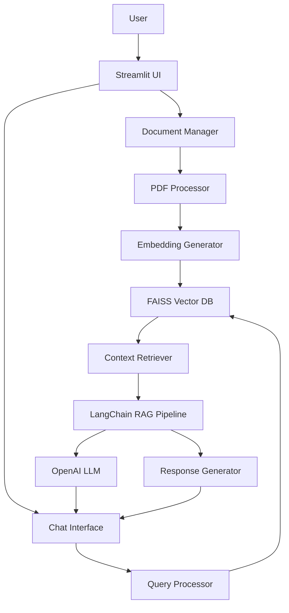
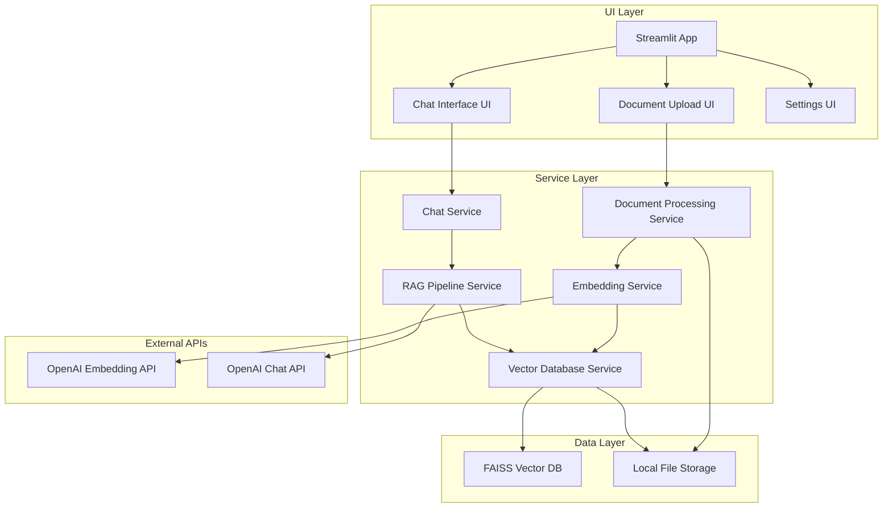

# RAG Chatbot Prototype Architecture Document

## Introduction / Preamble

This document outlines the technical architecture for the RAG Chatbot Prototype, a locally-deployed Python application that enables users to upload PDF documents and interact with them through a conversational AI interface. The architecture implements Retrieval-Augmented Generation (RAG) patterns using vector embeddings and semantic search to provide contextually relevant responses based on uploaded documents.

**Project Focus:** Local development and deployment with no cloud infrastructure requirements beyond OpenAI API access. The architecture prioritizes simplicity, rapid iteration, and clear separation of concerns to enable efficient AI agent implementation.

## Table of Contents

- [Technical Summary](#technical-summary)
- [High-Level Overview](#high-level-overview)
- [Architectural / Design Patterns Adopted](#architectural--design-patterns-adopted)
- [Component View](#component-view)
- [Project Structure](#project-structure)
- [API Reference](#api-reference)
- [Data Models](#data-models)
- [Core Workflow / Sequence Diagrams](#core-workflow--sequence-diagrams)
- [Definitive Tech Stack Selections](#definitive-tech-stack-selections)
- [Infrastructure and Deployment Overview](#infrastructure-and-deployment-overview)
- [Error Handling Strategy](#error-handling-strategy)
- [Coding Standards](#coding-standards)
- [Overall Testing Strategy](#overall-testing-strategy)
- [Security Best Practices](#security-best-practices)
- [Key Reference Documents](#key-reference-documents)

## Technical Summary

The RAG Chatbot Prototype implements a document-centric conversational AI system using a monolithic Python application architecture. The system processes PDF documents through a pipeline: text extraction → chunking → vector embedding → FAISS storage → semantic search → LLM-powered response generation. 

Key architectural decisions support rapid local development: Streamlit provides the web interface and session management, LangChain orchestrates the RAG pipeline, FAISS enables efficient vector similarity search, and OpenAI APIs handle both embedding generation and conversational responses. The architecture emphasizes modularity within the monolith to support clear component boundaries and AI agent implementation efficiency.

## High-Level Overview

**Architectural Style:** Monolithic application with clear internal component separation. Single Python process serves web interface, manages document processing, maintains vector database, and orchestrates conversational AI workflows.

**Repository Structure:** Monorepo containing all application code, configuration, tests, and documentation for streamlined local development.

**Primary Data Flow:** User uploads PDF → text extraction → chunking → embedding generation → vector storage → user queries → semantic search → context retrieval → LLM response generation → user interface display.



## Architectural / Design Patterns Adopted

- **Pipeline Pattern** - Document processing flows through distinct stages (extract → chunk → embed → store) enabling clear component boundaries and testability
- **Repository Pattern** - Abstract vector database operations behind interfaces supporting future database engine changes and comprehensive testing
- **Strategy Pattern** - Pluggable components for PDF processing, chunking algorithms, and embedding models enabling experimentation and optimization
- **Session State Management** - Streamlit session state maintains user context, conversation history, and application state throughout user sessions
- **Service Layer Pattern** - Business logic encapsulated in service classes separate from UI and data access concerns
- **Factory Pattern** - Centralized creation of LangChain components, OpenAI clients, and FAISS indices with configuration management

## Component View

The system comprises six major logical components with clear responsibilities and minimal coupling:

### Document Processing Service
**Responsibility:** PDF text extraction, chunking, and preparation for embedding
- PDF text extraction using PyPDF2 or similar libraries
- Intelligent text chunking with configurable size and overlap
- Document metadata preservation and management
- Error handling for corrupted or unsupported files

### Embedding Service  
**Responsibility:** Vector embedding generation and management using OpenAI APIs
- Text-to-vector embedding using OpenAI's embedding models
- Batch processing optimization for multiple chunks
- Rate limiting and retry logic for API reliability
- Embedding caching and persistence strategies

### Vector Database Service
**Responsibility:** FAISS vector database operations and persistence
- FAISS index creation, management, and persistence
- Vector similarity search with configurable parameters
- Index optimization and memory management
- Metadata association with vector entries

### RAG Pipeline Service
**Responsibility:** LangChain-orchestrated retrieval and generation workflows
- Query embedding and similarity search coordination
- Context retrieval and relevance filtering
- LLM prompt construction with retrieved context
- Response generation and source attribution

### Chat Service
**Responsibility:** Conversation management and user interaction coordination
- Session-based conversation history management
- Context window management for LLM interactions
- User query processing and validation
- Response formatting and presentation

### Streamlit UI Components
**Responsibility:** User interface presentation and interaction handling
- Document upload and management interfaces
- Chat interface with conversation display
- Configuration and settings management
- System status and analytics presentation



## Project Structure

```plaintext
rag-chatbot-prototype/
├── .env.example                    # Environment variable template
├── .gitignore                      # Git ignore rules
├── requirements.txt                # Python dependencies
├── README.md                       # Project setup and usage instructions
├── main.py                         # Streamlit application entry point
├── config/                         # Configuration files
│   ├── __init__.py
│   ├── settings.py                 # Application configuration management
│   └── logging.py                  # Logging configuration
├── src/                            # Application source code
│   ├── __init__.py
│   ├── services/                   # Business logic services
│   │   ├── __init__.py
│   │   ├── document_service.py     # PDF processing and text extraction
│   │   ├── embedding_service.py    # OpenAI embedding operations
│   │   ├── vector_service.py       # FAISS database operations
│   │   ├── rag_service.py          # LangChain RAG pipeline
│   │   └── chat_service.py         # Conversation management
│   ├── models/                     # Data models and schemas
│   │   ├── __init__.py
│   │   ├── document.py             # Document and chunk data models
│   │   ├── conversation.py         # Chat message and session models
│   │   └── search.py               # Search result and context models
│   ├── utils/                      # Utility functions and helpers
│   │   ├── __init__.py
│   │   ├── pdf_utils.py            # PDF processing utilities
│   │   ├── text_utils.py           # Text chunking and cleaning utilities
│   │   └── openai_utils.py         # OpenAI API helpers and retry logic
│   └── ui/                         # Streamlit UI components
│       ├── __init__.py
│       ├── components/             # Reusable UI components
│       │   ├── __init__.py
│       │   ├── document_upload.py  # Document upload interface
│       │   ├── chat_interface.py   # Chat conversation interface
│       │   ├── sidebar.py          # Navigation and settings sidebar
│       │   └── status_display.py   # System status and analytics
│       └── pages/                  # Streamlit page definitions
│           ├── __init__.py
│           ├── chat.py             # Main chat page
│           ├── documents.py        # Document management page
│           └── settings.py         # Configuration page
├── data/                           # Local data storage
│   ├── uploads/                    # Temporary uploaded file storage
│   ├── vector_db/                  # FAISS index persistence
│   └── logs/                       # Application logs
├── tests/                          # Test suite
│   ├── __init__.py
│   ├── unit/                       # Unit tests
│   │   ├── test_document_service.py
│   │   ├── test_embedding_service.py
│   │   ├── test_vector_service.py
│   │   └── test_rag_service.py
│   ├── integration/                # Integration tests
│   │   ├── test_rag_pipeline.py
│   │   └── test_openai_integration.py
│   └── fixtures/                   # Test data and fixtures
│       └── sample_documents/
└── docs/                           # Project documentation
    ├── index.md                    # Documentation index
    └── deployment.md               # Local deployment guide
```

### Key Directory Descriptions

- **src/services/**: Core business logic implementing the document processing, embedding, vector search, and RAG pipeline functionality
- **src/models/**: Pydantic data models ensuring type safety and validation across the application
- **src/utils/**: Pure utility functions for PDF processing, text manipulation, and API interactions
- **src/ui/**: Streamlit-specific UI components and page definitions with clear separation between reusable components and page layouts
- **data/**: Local file system storage for uploaded documents, FAISS indices, and application logs
- **tests/**: Comprehensive test suite with unit tests for services and integration tests for workflows

### Notes

The structure emphasizes modularity within the monolith, enabling clear component boundaries that support both AI agent implementation and future architectural evolution. Session state management is centralized in the UI layer while business logic remains in services for testability and reusability.

## API Reference

### External APIs Consumed

#### OpenAI Embedding API

- **Purpose:** Generate vector embeddings for document chunks and user queries to enable semantic search
- **Base URL:** `https://api.openai.com/v1/embeddings`
- **Authentication:** Bearer token authentication using API key from environment variable `OPENAI_API_KEY`
- **Key Endpoints Used:**
  - **`POST /v1/embeddings`:**
    - Description: Generate embeddings for input text using specified model
    - Request Body Schema:
      ```json
      {
        "input": "string or array of strings",
        "model": "text-embedding-ada-002",
        "encoding_format": "float"
      }
      ```
    - Success Response Schema (Code: `200 OK`):
      ```json
      {
        "object": "list",
        "data": [
          {
            "object": "embedding",
            "embedding": [0.1, 0.2, ...],
            "index": 0
          }
        ],
        "model": "text-embedding-ada-002",
        "usage": {
          "prompt_tokens": 10,
          "total_tokens": 10
        }
      }
      ```
    - Error Response Schema (Codes: `400`, `401`, `429`, `500`):
      ```json
      {
        "error": {
          "message": "string",
          "type": "string",
          "code": "string"
        }
      }
      ```
- **Rate Limits:** 3,000 requests per minute for text-embedding-ada-002
- **Link to Official Docs:** https://platform.openai.com/docs/api-reference/embeddings

#### OpenAI Chat Completions API

- **Purpose:** Generate conversational responses using retrieved document context through LangChain integration
- **Base URL:** `https://api.openai.com/v1/chat/completions`
- **Authentication:** Bearer token authentication using API key from environment variable `OPENAI_API_KEY`
- **Key Endpoints Used:**
  - **`POST /v1/chat/completions`:**
    - Description: Generate chat completion responses with document context
    - Request Body Schema:
      ```json
      {
        "model": "gpt-3.5-turbo",
        "messages": [
          {
            "role": "system|user|assistant",
            "content": "string"
          }
        ],
        "temperature": 0.7,
        "max_tokens": 1000,
        "stream": false
      }
      ```
    - Success Response Schema (Code: `200 OK`):
      ```json
      {
        "id": "chatcmpl-123",
        "object": "chat.completion",
        "created": 1677652288,
        "model": "gpt-3.5-turbo",
        "choices": [
          {
            "index": 0,
            "message": {
              "role": "assistant",
              "content": "string"
            },
            "finish_reason": "stop"
          }
        ],
        "usage": {
          "prompt_tokens": 56,
          "completion_tokens": 31,
          "total_tokens": 87
        }
      }
      ```
- **Rate Limits:** Model-dependent, typically 3,500 requests per minute for GPT-3.5-turbo
- **Link to Official Docs:** https://platform.openai.com/docs/api-reference/chat

## Data Models

### Core Application Entities

#### Document

- **Description:** Represents an uploaded PDF document with processing metadata and chunk relationships
- **Schema / Interface Definition:**
  ```python
  from pydantic import BaseModel
  from typing import List, Optional
  from datetime import datetime

  class Document(BaseModel):
      id: str  # Unique identifier (UUID)
      filename: str  # Original filename from upload
      file_size: int  # File size in bytes
      upload_timestamp: datetime  # When document was uploaded
      processing_status: str  # "pending", "processing", "completed", "failed"
      total_chunks: int  # Number of text chunks generated
      error_message: Optional[str] = None  # Error details if processing failed
      metadata: dict = {}  # Additional document metadata
  ```
- **Validation Rules:** 
  - filename must not be empty and should end with .pdf
  - file_size must be positive and under 50MB (52,428,800 bytes)
  - processing_status must be one of the defined values

#### DocumentChunk

- **Description:** Represents a processed text segment from a document with embedding and metadata
- **Schema / Interface Definition:**
  ```python
  class DocumentChunk(BaseModel):
      id: str  # Unique identifier (UUID)
      document_id: str  # Reference to parent document
      chunk_index: int  # Sequential index within 